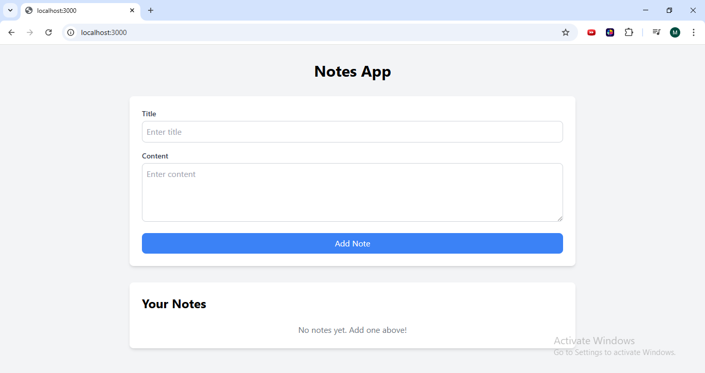
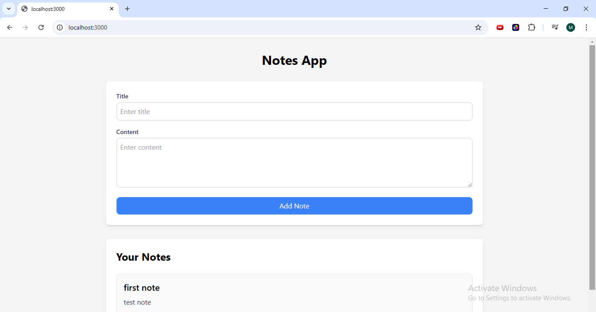

# Notes App

A simple full-stack notes application built with **Next.js** (frontend) and **Express** (backend). The app allows users to create, view, and manage notes.

---

## Features

- **Frontend**:
  - Built with **Next.js 14+** and **TypeScript**.
  - Styled using **Tailwind CSS**.
  - Responsive and user-friendly UI.
  - Form to add new notes.
  - List to display all notes.

- **Backend**:
  - Built with **Express** and **TypeScript**.
  - In-memory storage for notes.
  - REST API with two endpoints:
    - `GET /api/notes`: Fetch all notes.
    - `POST /api/notes`: Add a new note.

---

## Technologies Used

- **Frontend**:
  - Next.js
  - TypeScript
  - Tailwind CSS
  - Axios (for API calls)

- **Backend**:
  - Express
  - TypeScript
  - CORS (for cross-origin requests)

---
```
## Project Structure
notes-app/
├── backend/ # Express backend
│ ├── src/
│ │ └── index.ts # Backend server code
│ ├── package.json # Backend dependencies
│ └── tsconfig.json # TypeScript config for backend
├── frontend/ # Next.js frontend
│ ├── components/
│ │ └── NoteCard.tsx # NoteCard component
│ ├── hooks/
│ │ └── useNotes.ts # Custom hook for notes
│ ├── pages/
│ │ └── index.tsx # Main page
│ ├── styles/
│ │ └── globals.css # Global styles
│ ├── next.config.js # Next.js config
│ ├── tailwind.config.js # Tailwind CSS config
│ ├── package.json # Frontend dependencies
│ └── tsconfig.json # TypeScript config for frontend
├── package.json # Root dependencies (for running both frontend and backend)
└── README.md # Project documentation

```
---

## Setup Instructions

### Prerequisites

- Node.js (v16 or higher)
- npm (v8 or higher)

---

### Step 1: Clone the Repository
```bash
git clone https://github.com/your-username/notes-app.git
cd notes-app
```
### Step 2: Install Dependencies

Backend:
```bash
cd backend
npm install
```
Frontend:
```bash
cd ../frontend
npm install
``` 

### Step 3: Run the Project
Start the Backend:
```bash
cd backend
npm start
```
The backend will run on http://localhost:3001.

Start the Frontend:
```bash
cd ../frontend
npm run dev
```
The frontend will run on http://localhost:3000.

### Step 4: Access the Application
1.Open your browser and go to http://localhost:3000.

2.Use the form to add new notes.

3.View all notes in the list below the form.

## API Endpoints
---
### Backend (Express)
• **Fetch All Notes**:
   • **Method**: GET
   • **URL**: http://localhost:3001/api/notes
   • **Response**:
```json
        [
          {
            "title": "Test Note",
            "content": "This is a test note."
          }
        ]
```
• **Add a New Note**:
   • **Method**: POST
   • **URL**: http://localhost:3001/api/notes
   • **Request Body**:  
```json 
       {
         "title": "Test Note",
         "content": "This is a test note."
       }
```
   • **Response**:
```json
       {
         "title": "Test Note",
         "content": "This is a test note."
       }
```
## Screenshots
---
### Home Page


### Add Note



## Acknowledgments

- [Next.js Documentation](https://nextjs.org/docs)
- [Express Documentation](https://expressjs.com/)
- [Tailwind CSS Documentation](https://tailwindcss.com/docs)


Enjoy using the Notes App! 🚀
